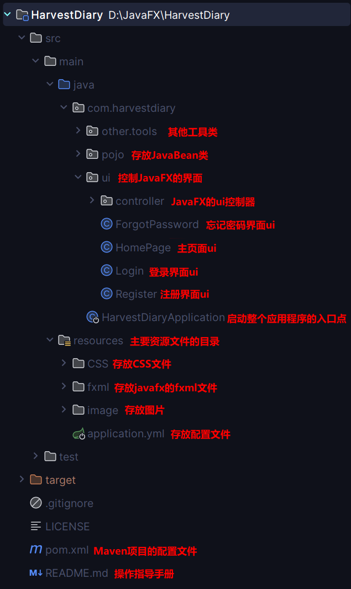
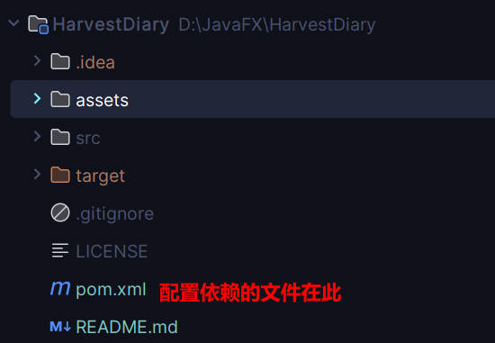
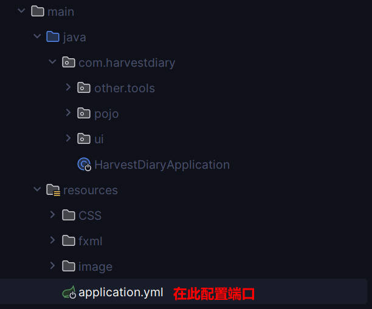
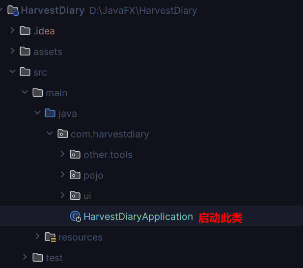

# HarvestDiary

#### 介绍

这是一个用javafx写的一个小软件，名叫HarvestDiary（收获日记）。

#### 软件架构

软件架构如下：



#### 安装教程

- 配置好Maven的依赖
  
  

- 先配置好yml文件的端口，避免端口冲突
  
  
  
  ```yml
  #修改启动端口号
  server:
    port: 8090
  ```

#### 使用说明

1. 启动HarvestDiaryApplication.java
   
   

2. xxxx

3. xxxx

#### 参与贡献

1. Fork 本仓库
2. 新建 Feat_xxx 分支
3. 提交代码
4. 新建 Pull Request

#### 特技

1. 使用 Readme\_XXX.md 来支持不同的语言，例如 Readme\_en.md, Readme\_zh.md
2. Gitee 官方博客 [blog.gitee.com](https://blog.gitee.com)
3. 你可以 [https://gitee.com/explore](https://gitee.com/explore) 这个地址来了解 Gitee 上的优秀开源项目
4. [GVP](https://gitee.com/gvp) 全称是 Gitee 最有价值开源项目，是综合评定出的优秀开源项目
5. Gitee 官方提供的使用手册 [https://gitee.com/help](https://gitee.com/help)
6. Gitee 封面人物是一档用来展示 Gitee 会员风采的栏目 [https://gitee.com/gitee-stars/](https://gitee.com/gitee-stars/)
   
   
   
   
   
   
   
   
   
   


